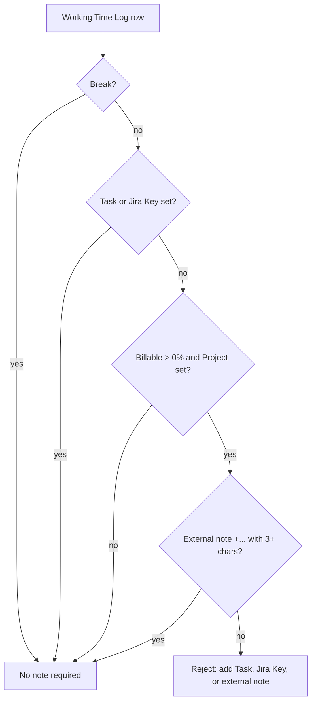

Timetracking and Attendance in ERPNext, integrated with Jira

## Who is this for?

Companies that use Atlassian Jira for project management and ERPNext for time tracking and billing.

## Features

- Allows logging of miscellaneous time, project time, breaks and paid breaks
- Allows to set a percentage of working time as billable time in a Working Time Log
- Rounds billable time to 5 minutes
- Fetches issue titles from Jira (used as time log description)
- Creates ERPNext **Timesheets**
- Creates ERPNext **Attendances**
- Report of actual vs. expected working time per Employee
- Sends email reminders to employees for submitting their draft working time entries
    - If a draft working time entry is older than 3 days, and
    - on the last working day of the month
- **Working Time Policy** enforcement per employee, including:
    - Maximum productive time per day
    - Mandatory break requirements based on productive time thresholds
    - Minimum rest time between days
    - Blocked weekdays
    - Holiday blocking (based on the employee's holiday list)

## Setup

- Install this app

   ```bash
   bench get-app https://github.com/alyf-de/working_time
   bench install-app working_time
   ```

- Create a **Jira Site**, enter your _Site URL_, _Username_ and a non-scoped _API Token_
  (scoped API tokens are not supported)
- Enable _Ignore Employee Time Overlap_ and _Ignore User Time Overlap_ in **Projects Settings**
- Open or create an ERPNext **Project**
    - Link it to your **Jira Site**
    - Set the _Billing Rate per Hour_
- Create **Activity Cost** records for your **Employees** (_Activity Type_: "Default")
- Create your first **Working Time**
    - Add a time log with description,
    - Add a time log and mark it as a break,
    - Add a time log and link it to a _Project_ and Jira issue _Key_
- Submit your **Working Time**

## Time Fields

**Working Time** separates productive time, break time and paid time:

- _Productive Time_ (`productive_time`) is the total duration of logs that are not marked as breaks.
- _Break Time_ (`break_time`) is the total duration of logs marked as breaks, including paid breaks.
- _Paid Break Time_ (`paid_break_time`) is the total duration of break logs where _Paid_ (`is_paid_break`) is enabled.
- _Paid Working Time_ (`working_time`) is the paid total: _Productive Time_ plus _Paid Break Time_. Number cards, stats and reports use this field as the paid working time total.
- _Project Time_ (`project_time`) and _Billable Time_ (`billable_time`) are calculated from non-break project logs.

In a **Working Time Log**, mark _Break_ (`is_break`) for any physical break. Regular working logs are paid by default and should not be marked as breaks. Regular breaks are unpaid by default. Use _Paid_ (`is_paid_break`) only for exceptional break rows that should count toward paid working time, such as mandatory but passive travel time.

**Working Time Policy** restrictions use _Productive Time_ for maximum time and threshold checks, while mandatory break requirements use _Break Time_. This means paid breaks count as paid time, but do not increase productive time for policy restrictions.

German users may refer to [this article](https://www.kanzlei-chevalier.de/blog/dienstreise-als-arbeitszeit) for more information.

## Notes on Time Logs

Each **Working Time Log** _Note_ is either **internal** or **external**:

| Type | Format | Used for |
|------|--------|----------|
| **Internal** | plain text | internal documentation only |
| **External** | starts with `+`, at least 3 characters after `+` | customer-facing invoice text |

On save, billable rows without a _Task_ or Jira _Key_ must include an external note with at least 3 characters after `+`.

### Short rules

**No note required when any of the following applies:**

- the row is a break
- a _Task_ is set
- a Jira _Key_ is set

**External note required when:**

- the row has a _Project_ and _Billable_ is greater than `0%`
- no _Task_ and no Jira _Key_

### Decision flow



### Examples

| Scenario | Result |
|----------|--------|
| `100%`, no _Task_/_Key_, note = `Fixed bug` | Rejected - internal note does not count for billing |
| `100%`, no _Task_/_Key_, note = `+Fixed bug` | OK - external note satisfies billable rule |
| `100%`, no _Task_/_Key_, note = `+ab` | Rejected - external note needs 3+ characters after `+` |
| `100%`, _Task_ set, no note | OK - _Task_ satisfies billable rule |

## Billable Time Logs

Billable rows (_Project_ set and _Billable_ greater than `0%`) must include at least one billing reference:

- a _Task_, or
- a Jira issue _Key_, or
- an external _Note_ (starting with `+`)

Rows with only an internal note are rejected on billable rows. Billable time is rounded to 5-minute increments when **Timesheets** are created on submit.

## Further Reading

Want to add pretty time logs to your invoice? Check out our [print formats](https://github.com/alyf-de/erpnext_druckformate).

## License

ERPNext extension "Working Time": Timetracking and Attendance in ERPNext, integrated with Jira.
Copyright (C) 2024 ALYF GmbH and contributors

This program is free software: you can redistribute it and/or modify
it under the terms of the GNU General Public License as published by
the Free Software Foundation, either version 3 of the License, or
(at your option) any later version.

This program is distributed in the hope that it will be useful,
but WITHOUT ANY WARRANTY; without even the implied warranty of
MERCHANTABILITY or FITNESS FOR A PARTICULAR PURPOSE.  See the
GNU General Public License for more details.

You should have received a copy of the GNU General Public License
along with this program.  If not, see <https://www.gnu.org/licenses/>.
